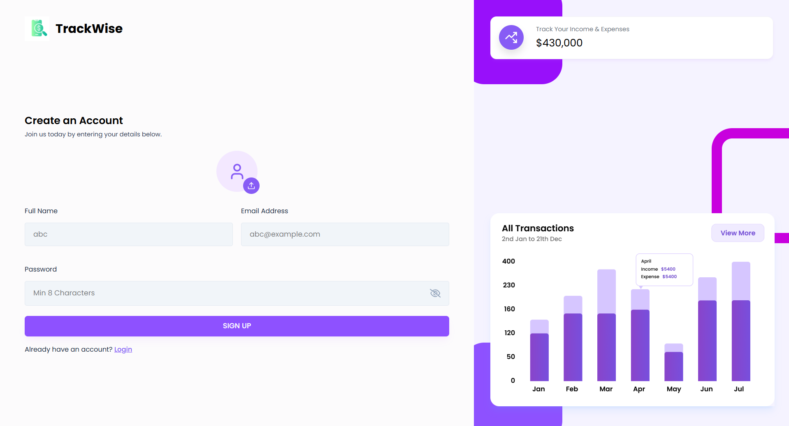
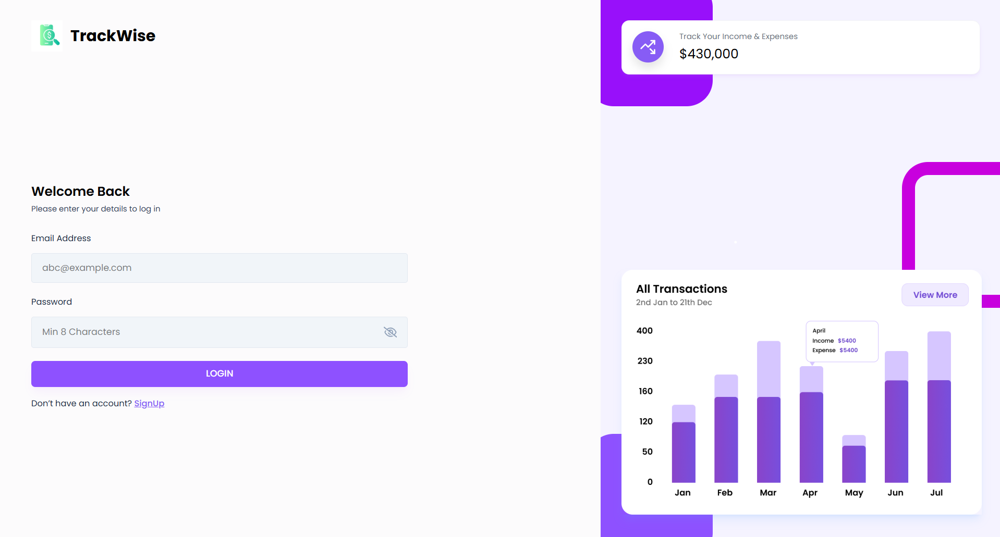
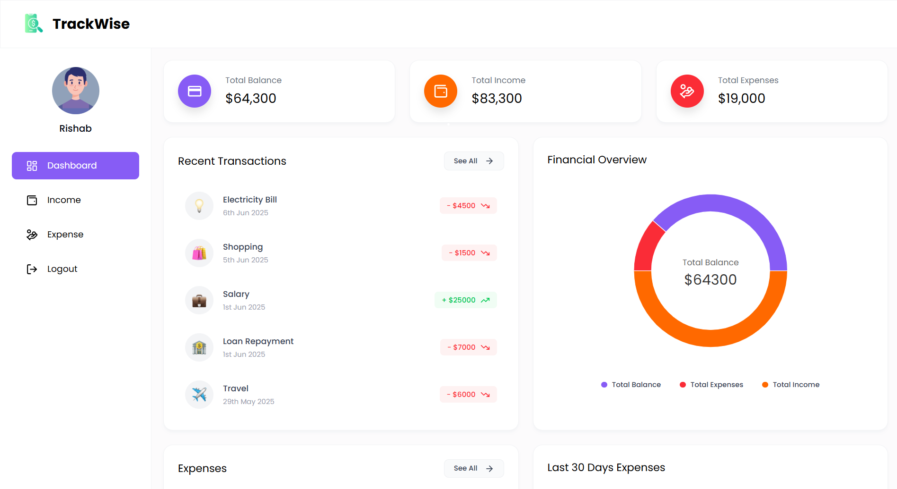
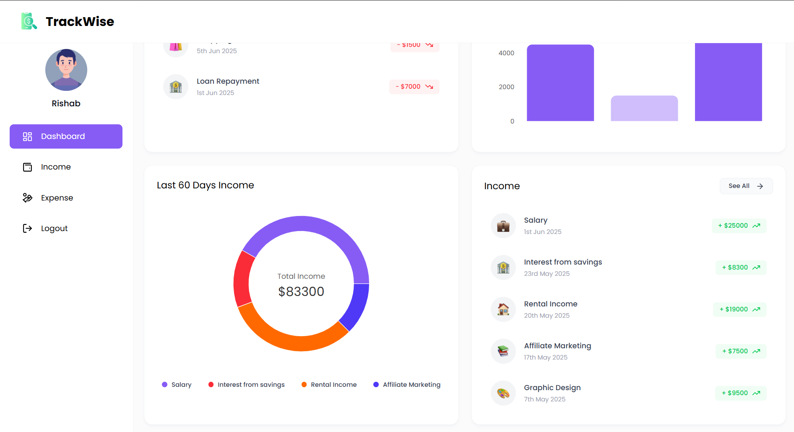
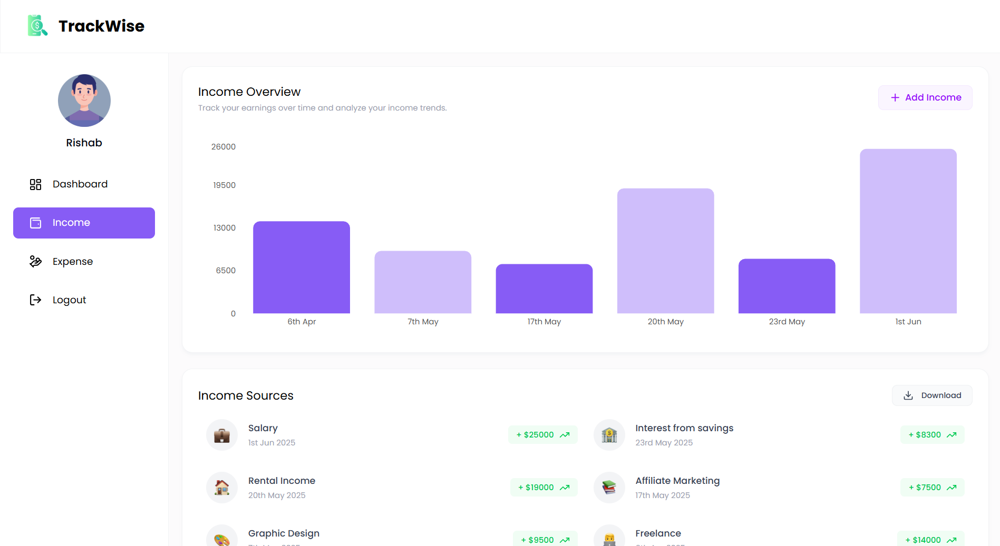
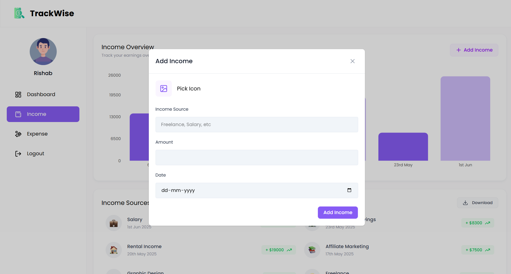
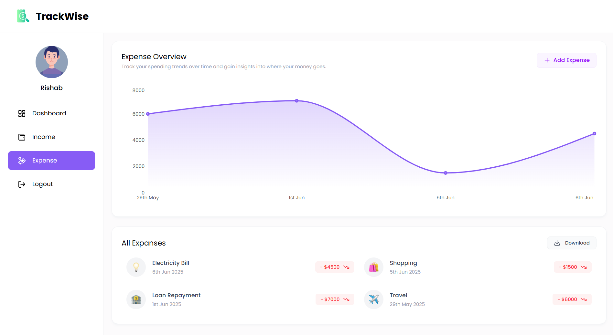
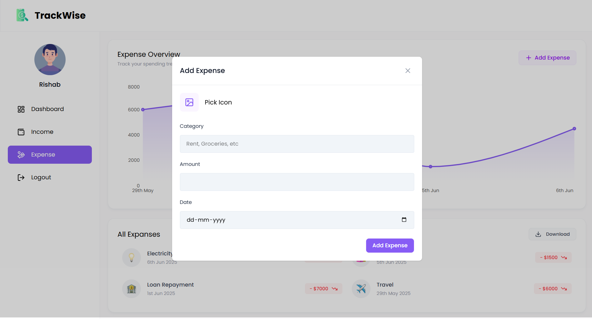

# 🚀 TrackWise – Full Stack Expense Tracker (MERN)

**TrackWise** is a powerful and intuitive full-stack Expense Tracker application built using the **MERN Stack** – **MongoDB**, **Express.js**, **React.js**, and **Node.js**.

It allows users to securely manage their income and expenses, visualize their financial activity through interactive charts, and download detailed reports in Excel format.

---

## 🔧 Tech Stack

- **Frontend**: React.js, Tailwind CSS, Recharts, Axios, Vite  
- **Backend**: Node.js, Express.js  
- **Database**: MongoDB  
- **Authentication**: JWT (JSON Web Token)

---

## ✨ Features

1. **User Authentication**  
   Secure login and sign-up with JWT authentication.

2. **Dashboard Overview**  
   Shows total balance, income, and expenses in summary cards.

3. **Income Management**  
   - Add, view, delete income  
   - Export income to Excel  

4. **Expense Management**  
   - Add, view, delete expenses  
   - Categorize expenses  
   - Export to Excel  

5. **Interactive Charts**  
   Visualize data with Bar, Pie, and Line charts.

6. **Recent Transactions**  
   View latest income and expense records.

7. **Download Reports**  
   Export all income and expense data in Excel format.

8. **Responsive Design**  
   Fully responsive for desktop, tablet, and mobile.

9. **Sidebar Navigation**  
   Easy access to Dashboard, Income, Expenses, Logout.

10. **Quick Delete**  
    Hover over entries to delete instantly.

---

## 📸 Screenshots
Below are some visuals of the TrackWise application:

### 📝 Sign-Up Page  
A clean and simple sign-up form to create a new account.



### 🔐 Login Page
Secure login page with JWT-based authentication.



### 🧾 Dashboard Overview
Get an overview of total balance, income, and expenses with interactive charts.




### 💰 Income Management
Manage, view, and analyze your income sources easily.



#### ➕ Add Income Page  
Form to add a new income entry with category and amount.



### 💸 Expense Management
Track, categorize, and manage all your expenses.



#### ➕ Add Expense Page  
Quickly add a new expense entry with necessary details.



---

## 🛠️ Getting Started

### 1. Clone the Repository

```bash
git clone https://github.com/your-username/TrackWise.git
cd TrackWise
```
### 2. Install Dependencies

```bash
cd backend
npm install
```
```bash
cd frontend
cd expense-tracker
npm install
```

### 3. Run the App
```bash
cd backend
npm run dev
```
```bash
cd frontend
cd expense-tracker
npm run dev
```
---
📁 Folder Structure
---
```BASH
TrackWise/
│
├── backend/             # Node.js + Express server
│
└── frontend/
    └── expense-tracker/ # React + Vite + Tailwind frontend
```
---

📄 License
---
This project is licensed under the MIT License.
